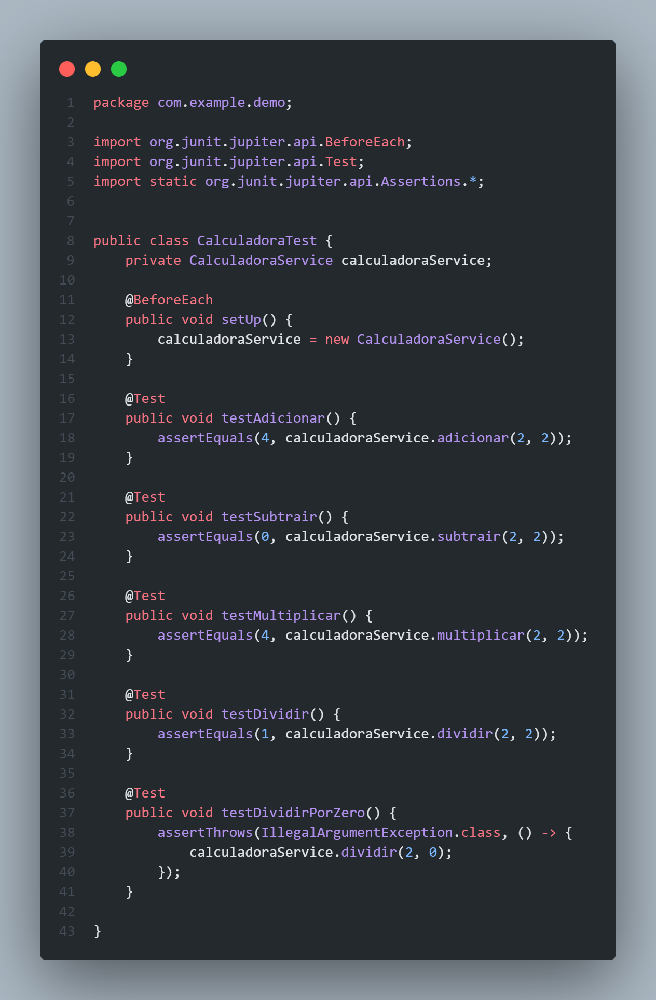

## Calculadora Java

projeto calculadora em java utilizando Spring Boot war

### Teste Unitario Usando JUnit

- Classe para testar cada metodo da calculadora



- Comando para rodar o test: `mvn test`

```powershell
[INFO] Tests run: 1, Failures: 0, Errors: 0, Skipped: 0, Time elapsed: 2.330 s -- in com.example.demo.DemoApplicationTests
[INFO]
[INFO] Results:
[INFO]
[INFO] Tests run: 6, Failures: 0, Errors: 0, Skipped: 0
[INFO]
[INFO] ------------------------------------------------------------------------
[INFO] BUILD SUCCESS
[INFO] ------------------------------------------------------------------------
[INFO] Total time:  6.036 s
[INFO] Finished at: 2024-08-17T12:46:29-03:00
[INFO] ------------------------------------------------------------------------
```